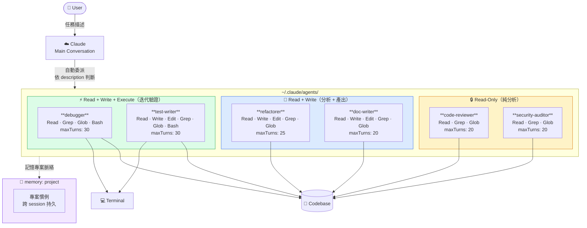

# 🤖 Agent Team Architecture

## 權限分層說明

| 層級 | Agents | 可執行動作 |
|------|--------|-----------|
| 🔒 Read-Only | code-reviewer, security-auditor | 讀取、搜尋 |
| 📝 Read + Write | refactorer, doc-writer | 讀取、搜尋、修改檔案 |
| ⚡ Read + Write + Execute | debugger, test-writer | 讀取、搜尋、修改檔案、執行指令 |
